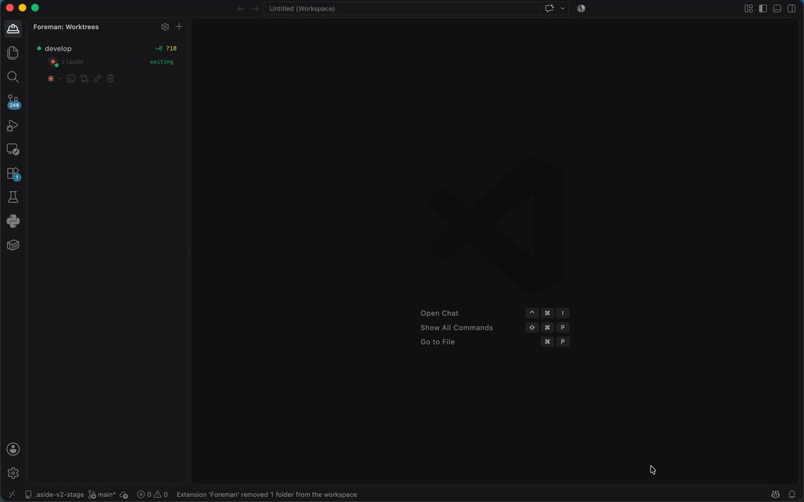

# Foreman

[](https://marketplace.visualstudio.com/items?itemName=foreman.foreman)
[](https://marketplace.visualstudio.com/items?itemName=foreman.foreman)
[](https://marketplace.visualstudio.com/items?itemName=foreman.foreman&ssr=false#review-details)
[](https://github.com/ricardomoratomateos/foreman/actions/workflows/ci.yml)
[](LICENSE)

**Run multiple AI coding agents in parallel — each in its own git worktree, its own tmux session, its own environment — without the mess.**

Foreman turns VS Code into a control panel for delegated work: spin up a git worktree per task, launch an AI coding agent (Claude Code, opencode, …) in it, and keep every session alive, isolated, and glanceable from one sidebar.

<!-- TODO: add a demo GIF here before publishing — e.g.  -->

## Why

Working on several things at once with AI agents gets messy fast: branches collide, terminals get lost on reload, you don't know which agent is waiting on you. Foreman gives each task a real git worktree and a persistent tmux-backed session, and surfaces their state so you always know what needs you.

## Features

- **Worktree manager in the sidebar** — create, rename, and delete git worktrees; each one is an isolated checkout you can work in independently.
- **Agents per worktree** — launch Claude Code or opencode (pluggable providers) in any worktree. Multiple agent + shell sessions per worktree, each tracked separately.
- **Sessions survive reloads** — agents run in tmux, so they keep working across VS Code window reloads and reconnect automatically.
- **State at a glance** — per-session status (working / waiting / needs permission / idle) with live task titles pulled from the agent, plus a sidebar badge and optional native notification when an agent needs you.
- **Scoped to the active worktree** — text search, Quick Open, and breakpoints are automatically scoped to the worktree you're in, so parallel worktrees don't drown each other out. Editor tabs can be scoped too — see [Switching worktrees](#switching-worktrees).
- **Diff review panel** — review a worktree's changes with per-line comments and feed them straight back to the agent, no PR round-trip needed.
- **Per-worktree debugging** *(optional)* — each worktree gets its own `launch.json` on a unique debug port, wired to its container, so you can step-debug several worktrees at once without ports colliding. Any debugger VS Code supports — Node by default, PHP, Python, Go, whatever your stack runs.
- **Per-worktree Docker** *(optional)* — start/stop a dedicated compose stack per worktree with auto-generated, collision-free ports.
- **Per-worktree setup/teardown** *(optional)* — run a repo-local script when a worktree is created or removed (install deps, copy env, boot services).

## Requirements

- **VS Code** 1.85 or newer
- **[tmux](https://github.com/tmux/tmux)** — sessions are multiplexed and survive reloads through it (Foreman prompts to install it if missing)
- **git** with worktree support
- An **agent CLI** on your `PATH` — [Claude Code](https://docs.anthropic.com/en/docs/claude-code) (`claude`) and/or [opencode](https://opencode.ai) (`opencode`)

> **Platform:** macOS and Linux. Native OS notifications are macOS-only; everything else works on both. Windows is supported only via WSL (tmux required).

## Getting started

1. Install tmux and an agent CLI (`claude` or `opencode`).
2. Open a git repository in VS Code and open the **Foreman** view in the activity bar.
3. Hit **+** to create a worktree for your task.
4. Click the agent button on the worktree card to launch Claude Code / opencode in it.
5. Watch status in the sidebar; switch worktrees to jump between tasks — switching is instant, and search and breakpoints follow you.

The **Get started with Foreman** walkthrough (opens on install; later under *Help → Welcome → Walkthroughs*, or `Foreman: Getting Started`) walks through the same steps inside VS Code.

To hand an agent a screenshot, drop the image straight onto its terminal — VS Code opens it as a tab, Foreman closes that tab and attaches the file to the agent in that editor group. `Cmd+Alt+V` in the agent's terminal attaches the latest screenshot from your screenshots folder.

For the heavier setup — Docker per worktree, a debugger port per worktree, setup/teardown scripts — open **Foreman settings** with the gear next to **+** in the Worktrees header. It prefills what it finds in the repository (compose files, their `${HTTP_PORT}`-style ports, the language stack) and saves the project half to `.foreman/config.json` so the whole team inherits it, and your own preferences to your VS Code settings.

## Settings

| Setting | Default | Description |
|---|---|---|
| `foreman.worktreesDirectory` | `.worktrees` | Where worktrees are created (relative to the workspace root) |
| `foreman.defaultBaseBranch` | `develop` | Branch new worktrees start from, preselected in the New Task form. When it doesn't exist, Foreman uses the repo's own main line (first of `main`/`master`/`develop` it finds, local or remote), then the current branch |
| `foreman.defaultProvider` | `claude` | Primary agent: the one the big launch button starts. The chevron beside it opens the rest |
| `foreman.claudeCommand` | `claude` | Command to launch Claude Code |
| `foreman.codexCommand` | `codex` | Command to launch Codex CLI |
| `foreman.grokCommand` | `grok` | Command to launch Grok Build |
| `foreman.opencodeCommand` | `opencode` | Command to launch opencode |
| `foreman.notifyOnAttention` | `true` | Native OS notification when an agent finishes or asks for permission while VS Code is backgrounded (the sidebar badge always shows) |
| `foreman.scopeSearchToActiveWorktree` | `true` | Hide non-active worktree folders from search and Quick Open |
| `foreman.focusMode` | `false` | Clean-slate switching: close the other worktrees' editor tabs and agent terminals so only the active worktree is on screen (see [Switching worktrees](#switching-worktrees)) |
| `foreman.setupScript` / `foreman.teardownScript` | `""` | Script run on worktree create / delete (e.g. `.foreman/setup.sh`) |
| `foreman.docker` | — | Per-worktree compose file + auto-generated ports (opt-in; see below) |
| `foreman.debugBasePort` | `9898` | First debug port; each worktree takes the next free slot above it |
| `foreman.debugTemplate` | node attach | `launch.json` template generated per worktree (`{{PORT}}`, `{{WORKTREE_PATH}}`); any debugger, see [Debugging](#per-worktree-debugging) |

## Agents

Four are supported: **Claude Code**, **Codex CLI**, **Grok Build** and **opencode**. Each worktree card carries a split button — the big half launches your primary agent (`foreman.defaultProvider`), the chevron opens the rest. Agents whose command isn't on your `PATH` are shown dimmed; clicking one offers the install command instead of launching it.

Any session can be renamed — hover its row and hit the pencil. The shell you started redis in becomes "redis". The name is Foreman's own; the tmux window keeps the name that says what is running in it, because that is what identifies an agent when the window reloads. Clearing the name restores the derived one.

Shell sessions carry a subtitle too, in the same slot the agents use for their live task: whatever the shell is running right now — `npm`, `vim`, `psql`, `docker`. A shell sitting at its prompt says nothing rather than repeating its own name. It needs no shell configuration; the reading comes from tmux itself.

Foreman registers a notify hook with each agent so the sidebar can show live state (thinking / waiting / needs attention). Two caveats worth knowing:

- **Codex's hook system is experimental and off by default.** Foreman writes the hooks, but Codex ignores them — silently, so its sessions simply never change state — until you enable the feature yourself in `~/.codex/config.toml`:

  ```toml
  [features]
  codex_hooks = true
  ```

  Codex also has no session-end event, so a Codex session settles on *waiting* rather than ever showing *terminated*.
- **Codex and Grok require you to trust hooks** before they run (`/hooks` and `/hooks-trust` respectively). Foreman's notify script is byte-identical on every install for exactly this reason — the endpoint lives in a sibling file, so a restart never changes the script's hash and never costs you that trust.

Grok has no permission-request event; its `Notification` event is what drives the attention badge instead.

## Switching worktrees

Clicking a worktree in the sidebar switches to it. There are two behaviours, trading screen tidiness against churn.

**Reveal (default).** Switching brings the worktree's agent terminal to the front and re-applies search scoping and explorer dimming. Nothing is closed or recreated, so switching is instant and flicker-free, and VS Code keeps your editor tabs exactly where you left them. No file is opened for you — that kept the terminal and the editor fighting over the foreground. The cost: tabs and agent terminals from the worktrees you've visited stay open.

**Focus mode** (`"foreman.focusMode": true`). Switching gives you a clean slate: the other worktrees' editor tabs are closed and their agent terminals detached, so only the active worktree is on screen. Each worktree's open files are remembered and reopened, in order, when you come back to it. The cost: visible churn on every switch, since tabs and a terminal really are torn down and rebuilt. Unsaved work is saved first, because tabs are about to close.

> Neither mode ever interrupts an agent: agents run in tmux, so detaching a terminal leaves them working. Only deleting a worktree or killing a session explicitly stops one.

## Staying in sync with the base branch

Each worktree card shows how far its branch has drifted from the branch it was cut from — `origin/develop  ↓12` under Git. That is a different question from ahead/behind, which compares against your own upstream and answers "have I pushed"; this one answers "should I rebase", and it is the number that grows while you work.

The base is recorded when the worktree is created, so a worktree cut from `release/3.2` keeps measuring against `release/3.2` however `foreman.defaultBaseBranch` moves afterwards. Worktrees adopted from git carry no such record and fall back to the configured base. Nothing is shown for the main worktree, or for a worktree sitting on the base itself.

**Foreman never fetches on its own.** The drift is read on a filesystem watch that fires as you save, and putting a network round trip behind that — on repositories whose remotes may be slow or want credentials — is not something to do uninvited. It compares against `origin/<base>` when that ref exists and the local `<base>` otherwise, and the card always names which, so the answer is never presented as fresher than it is. Keeping the remote ref current is whatever you already use for that: VS Code's own `git.autofetch`, a terminal `git pull` — or clicking the row, which fetches that one branch from `origin` and re-reads.

## Per-repo configuration

For heavier setups (dedicated Docker stack, dependency prep, debug), point the `foreman.setupScript` / `foreman.teardownScript` and `foreman.docker` settings at your own script and compose files — **anywhere in the repo**, wherever you like to keep them.

When it runs your setup script, Foreman exports `FOREMAN_REPO_ROOT`, `FOREMAN_WORKTREE_PATH`, `FOREMAN_BRANCH`, `FOREMAN_COMPOSE_PROJECT` and the worktree's auto-generated ports, and the matching debug port is wired into the generated `launch.json`. Relative paths resolve against the worktree first, then the main repo.

Each worktree's ports are listed on its card, under Docker, and clicking one opens `http://localhost:<port>` — the numbers are derived from the same function that builds the compose environment, so the card cannot drift from what the container actually publishes. The debug port is shown when you name `DEBUG_PORT` but is not clickable; a debugger listener answers nothing a browser can render.

Ports are checked against the machine, not just against Foreman's own bookkeeping: every port a worktree will bind is probed before the slot is handed out, and probed again right before a setup script or `compose up` runs. If something has taken one in the meantime — another project's container, a leftover stack from a deleted worktree, a local dev server — the worktree moves to a free slot, its `launch.json` follows, and you get a toast naming the port that was busy. Re-run your setup script afterwards if it bakes the port into a generated file such as `.env`.

> A `.foreman/` folder is a handy place to keep these together. Scripts and compose files can live anywhere; only `.foreman/config.json` below is a fixed path.

## Per-worktree debugging

Every worktree is handed a debug port of its own — `foreman.debugBasePort` plus the worktree's slot — and a `.vscode/launch.json` generated from `foreman.debugTemplate` with that port substituted in. Five worktrees means five listeners on five ports, so you can sit on a breakpoint in one while another keeps running.

The template is passed through whole. Foreman substitutes `{{PORT}}` and `{{WORKTREE_PATH}}`, fills in a `name` if you left one out, and reads nothing else — so any debugger VS Code supports works the same way. The shipped default attaches to Node:

```json
{
  "type": "node",
  "request": "attach",
  "port": "{{PORT}}"
}
```

PHP with Xdebug against a container, for comparison:

```json
{
  "type": "php",
  "request": "launch",
  "port": "{{PORT}}",
  "pathMappings": { "/var/www": "{{WORKTREE_PATH}}" }
}
```

Name `DEBUG_PORT` in `foreman.docker.ports` and the container is handed the same number in its environment, so what your compose file publishes and what the listener waits on cannot drift apart.

## Sharing the setup with your team

Most of the settings above describe the *project*, not you: where worktrees go, which compose files exist, which branch work starts from, what the setup script is called. Keeping them in your own `settings.json` means a teammate who clones the repo gets an extension that does nothing useful until someone pastes them a copy of your config.

Put them in **`.foreman/config.json`** instead and commit it:

```json
{
  "version": 1,
  "worktreesDirectory": ".worktrees",
  "defaultBaseBranch": "main",
  "setupScript": ".foreman/setup.sh",
  "teardownScript": ".foreman/teardown.sh",
  "docker": {
    "composeFile": "docker-compose.yml",
    "overrideFile": "docker-compose.worktree.yml",
    "ports": ["HTTP_PORT", "DB_PORT"],
    "basePort": 20000,
    "portStride": 100
  },
  "debugBasePort": 9898
}
```

Run **Foreman: Create Repo Config File** from the command palette to generate it from whatever is currently in effect on your machine — that's the handover: your working setup becomes a file that travels with the code.

**Precedence** is *your explicit setting* → *the repo file* → *the shipped default*. So the repo file gives everyone a sane starting point, and anyone who deliberately sets a value in their own `settings.json` keeps it. Only an explicitly-set value counts; a key you never touched doesn't shadow the repo's.

**Which keys it accepts:** `worktreesDirectory`, `defaultBaseBranch`, `setupScript`, `teardownScript`, `docker`, `debugBasePort`, `debugTemplate`. Every key is optional, and `docker` merges key by key — naming just your compose file won't reset `basePort`.

**Which it doesn't:** `defaultProvider`, the per-agent commands, `notifyOnAttention`, `focusMode`, `scopeSearchToActiveWorktree`. Which agent you reach for and where its binary lives are properties of your machine, and a repository you cloned has no business overriding them. Put one in the file and Foreman tells you so rather than quietly ignoring it.

A broken file never breaks the extension: bad JSON, an unknown key or a wrong type falls back to your own settings and says what was wrong.

## License

[MIT](LICENSE) © Ricardo Morato
